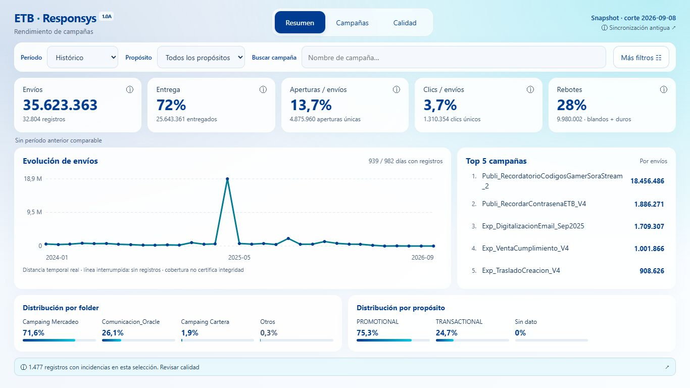

# Responsys 1.0A · Validación de entrega

Fecha: 5 de octubre de 2026. Fuente conservada: snapshot de 32.804 registros, corte `2026-09-08`, hash `1ff90bb8129c2372`.

## Resultados reproducibles

- Resumen inicial: 23.331 bytes sin comprimir. Logs del servidor confirman `overview.json` al inicio, sin `dashboard.json`, worker ni módulos de vistas. Campañas solicita el detalle y su módulo al abrirse.
- Paridad del motor TypeScript con el resumen generado en Python: histórico, últimos 30 días, últimos 90 días y año disponible.
- Conteos conservados: 35.623.363 envíos, 4.875.960 aperturas únicas, 1.310.354 clics únicos, 9.980.002 rebotes y 25.643.361 entregados calculados.
- Rendimiento local: consultas completas sobre 32.804 filas con medianas de aproximadamente 36–41 ms y máximo observado de 43,2 ms en cinco consultas tras calentamiento. Es una medida local, no una garantía universal de hardware.
- Compilación React/Vite/TypeScript correcta; módulos separados para Worker, Campañas y Calidad.
- Nueve pruebas Python y ocho pruebas TypeScript: contratos, fechas, comparaciones, anomalías, conservación de duplicados y actividad sin fechas, cabeceras requeridas, CSV, paginación y enlaces.

## Navegador sobre build de producción

- Ruta local `/TABLEROS_RES/`: carga, fragmentos, selección exacta y recarga conservando filtros y vista.
- 1366×768: resumen completo, sin scroll inicial; aviso final por debajo de 745 px.
- 1920×1080: resumen completo sin scroll inicial.
- 390 px: sin desbordamiento horizontal global en Resumen, Campañas y Calidad. Las tablas se desplazan dentro de sus contenedores.
- Ranking abre campaña exacta; detalle conserva 25 registros por página. Campaña de 734 registros muestra 30 páginas y cambia a la segunda.
- Cancelar filtros no aplica el borrador. Tab desde Aplicar vuelve al primer control del panel. Escape cierra y devuelve foco al botón de origen, también desde detalle de campaña.
- Histórico indica ausencia de comparación. Últimos 30 días usa `2026-08-10` a `2026-09-08`, comparado con `2026-07-11` a `2026-08-09`.
- CSV descargado desde Calidad: 1.477 registros con incidencias, aunque la tabla muestra solo 25. Exportación verificada con lector CSV, total de envíos 155.025.
- Fallo de resumen: mensaje y Reintentar. Fallo del detalle: mensaje sin datos combinados. Hash distinto: aviso para recargar. Worker no disponible: respaldo carga 312 campañas correctamente.
- Texto y cifras opacos; SVG adapta coordenadas para mantener ejes legibles en móvil. Foco visible, paneles modales con fondo inerte, reglas de movimiento reducido y respaldo blanco sin `backdrop-filter`.

## Procedencia y límite actual

Se conserva la configuración de lectura de la hoja existente. La sincronización viva requiere `GOOGLE_SERVICE_ACCOUNT_JSON` y compartir la hoja con la cuenta de servicio como lector. El snapshot permite entregar y publicar la versión 1.0A mientras se configura ese secreto. La interfaz lo indica explícitamente y avisa cuando la sincronización supera 48 horas.

Las incidencias no se borran ni corrigen automáticamente. Los controles globales de catálogos mantienen sus definiciones originales y se identifican como Fuente completa. Los conteos de incidencias pueden solaparse y no deben sumarse.

## Publicación

Implementación publicada en la rama `main` de `NR-ETB/TABLEROS_RES` el 5 de octubre de 2026. El push se completó mediante Git local usando la cuenta `NR-ETB`; la limitación de escritura del conector no impidió la publicación. El workflow genera, valida y despliega la versión 1.0A automáticamente después de cada push. Google Sheets vivo sigue requiriendo configurar las credenciales lectoras; mientras tanto se publica el snapshot identificado en la interfaz.

El push no confirma un despliegue completado. La ejecución `37364496982` aprobó el build, pero la asignación de runners de GitHub bloqueó su despliegue durante la incidencia de Actions del 5 de octubre. Pages se configuró con `build_type: workflow` para evitar el segundo proceso de publicación heredado. Se añadió una recuperación manual con macOS que reutiliza el paquete aprobado; su éxito debe comprobarse en Actions y en la URL pública.
